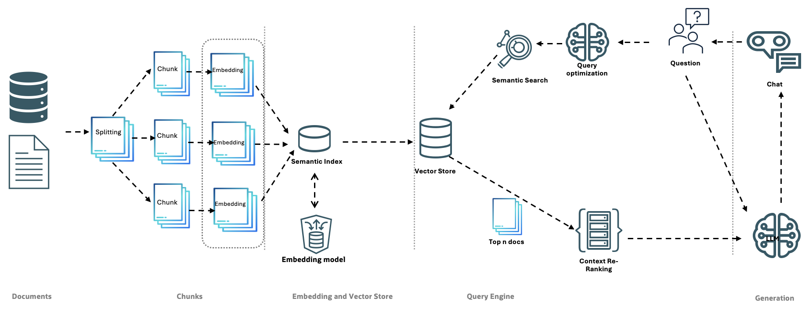

# RAG Application

<p align="center">
  
</p>

<p align="center">


</p>

This Retrieval-Augmented Generation (RAG) application leverages **OCI GenAI** as its language model and **Oracle Database 23ai** as a powerful vector store. Designed with a modular architecture, it emphasizes clean abstractions and separation of concerns, providing seamless integration with Oracle's advanced AI and database technologies.

## Features

- Modular architecture with well-defined interfaces
- Support for multiple chunking strategies (fixed-size and semantic)
- Integration with **OCI GenAI** for enhanced chat model functionality
- Multiple embedding model support (Cohere, OCI, Ollama)
- Flexible document and domain management
- Customizable query engine with optimization and re-ranking capabilities
- Support for multiple vector stores (Chroma, Oracle Database 23ai)
- Conversation management with history tracking
- Configurable system through JSON configuration files

## Architecture Overview

The application is built on a set of abstract interfaces, promoting loose coupling and easier testing. Below is a high-level architecture diagram of the RAG Application:



*Figure 1: High-level architecture diagram of the RAG Application*

The system comprises several key components:

1. **Storage Layer**:
   - Implements `StorageInterface` for raw document storage
   - Supports both file-based (`FileStorage`) and object storage implementations
   - Handles multiple document formats (PDF, DOCX, TXT, MD)

2. **Document Processing**:
   - Uses `DocumentInterface` and `DocumentFactoryInterface`
   - Supports both in-memory (`PythonDocument`) and database (`DBDocument`) implementations
   - Manages document metadata and content

3. **Chunking Strategies**:
   - Implements `ChunkStrategyInterface`
   - Provides `FixedSizeChunkStrategy` and `SemanticChunkStrategy`
   - Configurable chunk sizes and overlap settings

4. **Embedding Models**:
   - Implements `EmbeddingModelInterface`
   - Supports multiple providers:
     - Cohere (`CohereEmbedding`)
     - OCI (`OCIEmbedding`)
     - Ollama (`OllamaEmbedding`)

5. **Vector Stores**:
   - Implements `VectorStoreInterface`
   - Supports multiple backends:
     - Chroma (`ChromaVectorStore`)
     - Oracle Database 23ai (`Oracle23aiVectorStore`)
   - Factory pattern for store creation

6. **Query Processing**:
   - Query optimization through `QueryOptimizerInterface`
   - Result re-ranking via `ReRankerInterface`
   - Conversation management with `ConversationInterface`

7. **Chat Models**:
   - Implements `ChatModelInterface`
   - Supports OCI GenAI models:
     - Command-R Plus
     - Llama 3-70B

## Configuration

The application uses a flexible configuration system with support for:

- Environment-based settings through `.env` files
- JSON-based configuration files
- Runtime configuration updates
- Domain-specific vector store settings

Example configuration:

```json
{
    "chunking": {
        "STRATEGY": "semantic",
        "CHUNK_SIZE": 1000,
        "CHUNK_OVERLAP": 200,
        "MAX_CHUNK_SIZE": 1500
    },
    "embedding_model": {
        "PROVIDER": "oci",
        "MODEL_NAME": "cohere.embed-english-v3.0",
        "EMBEDDING_DIMENSION": 1024
    },
    "vector_store": {
        "DEFAULT_PROVIDER": "Chroma"
    }
}
```

## Requirements

- Python 3.10+
- FastAPI
- OCI GenAI
- Oracle Database 23ai (optional)
- Additional dependencies listed in `requirements.txt`

## Setup

1. Clone the repository:
   ```bash
   git clone https://github.com/fsabiu/RAG.git
   cd RAG
   ```

2. Create and activate a virtual environment:
   ```bash
   python -m venv venv
   source venv/bin/activate  # On Windows, use `venv\Scripts\activate`
   ```

3. Install dependencies:
   ```bash
   pip install -r requirements.txt
   ```

4. Set up your environment variables by copying the template:
   ```bash
   cp .env_template .env
   ```

   Example `.env` file content:
   ```
   # App Configuration
   APP_NAME=RAG Application
   APP_VERSION=1.0.0
   DEBUG=True
   LOG_LEVEL=INFO
   BACKEND_PORT=8000
   FRONTEND_URL=http://localhost:3000

   # API Keys
   COHERE_API_KEY=your_cohere_api_key

   # OCI Configuration
   OCI_COMPARTMENT_ID=ocid1.compartment.oc1..example
   OCI_GENAI_ENDPOINT=https://genai.aiservice.us-chicago-1.oci.oraclecloud.com
   OCI_CONFIG_PROFILE=DEFAULT
   OCI_CONFIG_PATH=~/.oci/config
   OCI_CHAT_DEFAULT_MODEL=cohere.command-r-plus-08-2024
   OCI_EMBEDDINGS_DEFAULT_MODEL=cohere.embed-multilingual-v3.0

   # Ollama Configuration
   OLLAMA_HOST=localhost
   OLLAMA_PORT=11434
   ```

4.1. Setting up front-end component
   Run the command "npm run build" in the front-end app directory and then copy the files from the "build" folder into "public" folder of this application

5. Running the application

   You have two options to run the application:
   
   ### Option 1: Using the start script
   ```bash
   ./scripts/start_app.sh
   ```

   ### Option 2: Using docker
   ```bash
   docker run -p 8000:8000 --env-file .env rag-app
   ```

   The application will be available at the port specified in the config file as BACKEND_PORT.

## Contributing

Contributions are welcome! Please feel free to submit a Pull Request.

## License

This project is licensed under the Apache 2.0 License - see the [LICENSE](LICENSE) file for details.